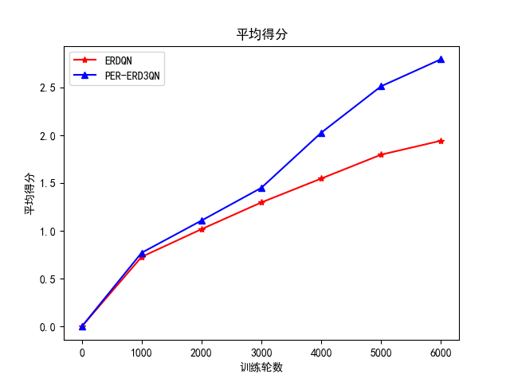

# PER-ERD3QN
PER-ERD3QN为[ERDQN](https://github.com/Miss-Diana-jiarannie/ERDQN/tree/master)的改进, 相比于原仓库增加了优先经验回放（PER）与Dueling DQN。改进后得分增加明显。

PER-ERD3QN improvement for [ERDQN](https://github.com/Miss-Diana-jiarannie/ERDQN/tree/master), compared to the original warehouse to increase the priority of experience playback (PER) and Dueling DQN. The score increased significantly after improvement.

